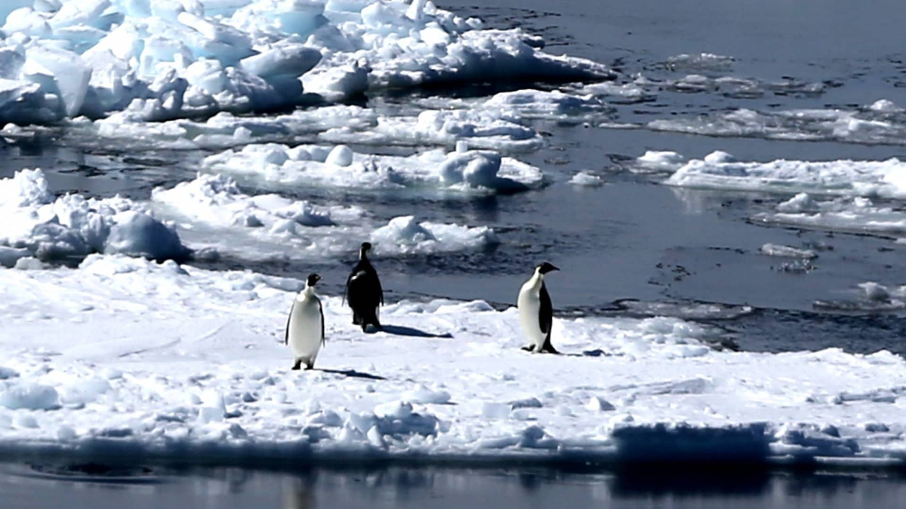
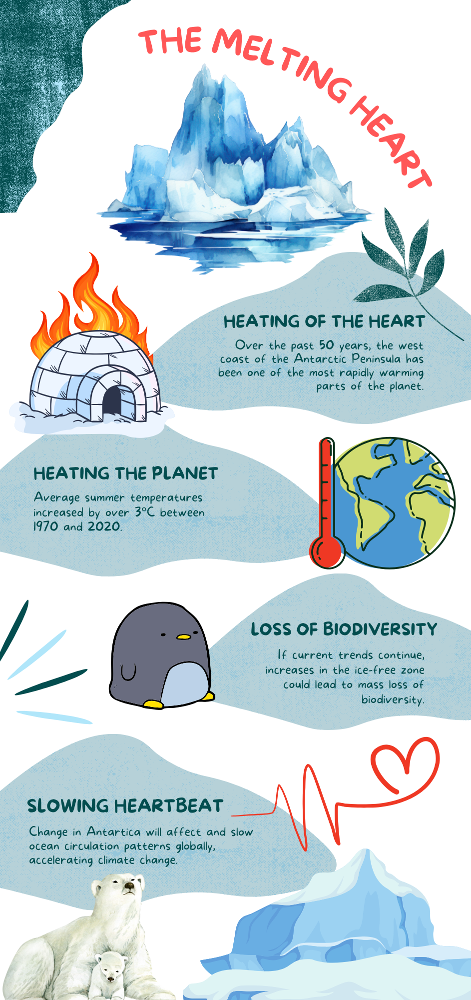
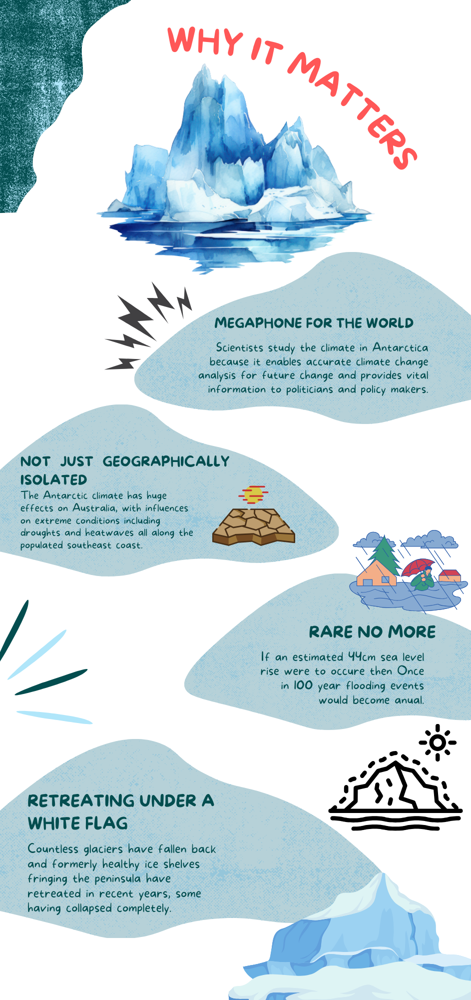
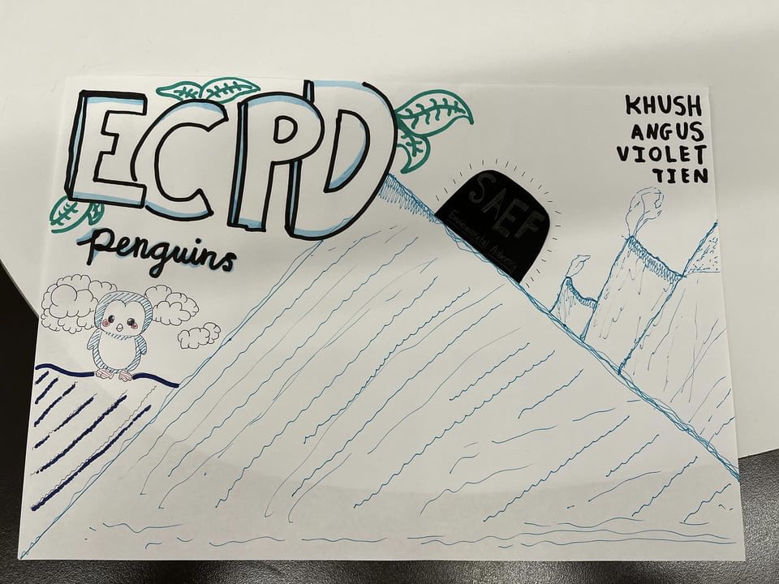
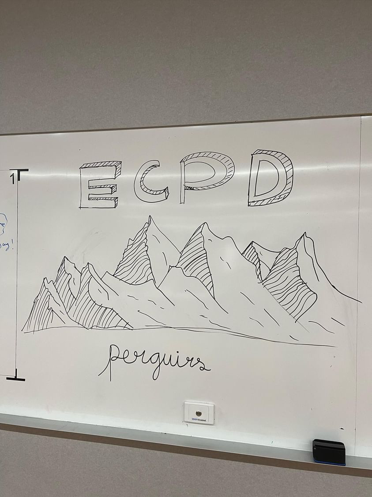
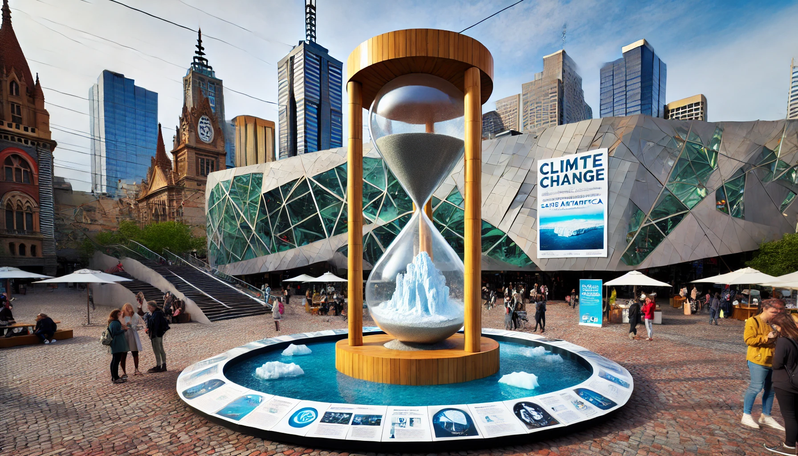
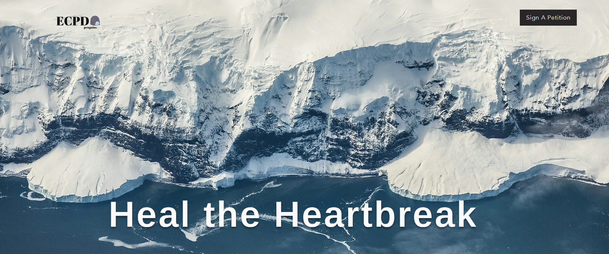
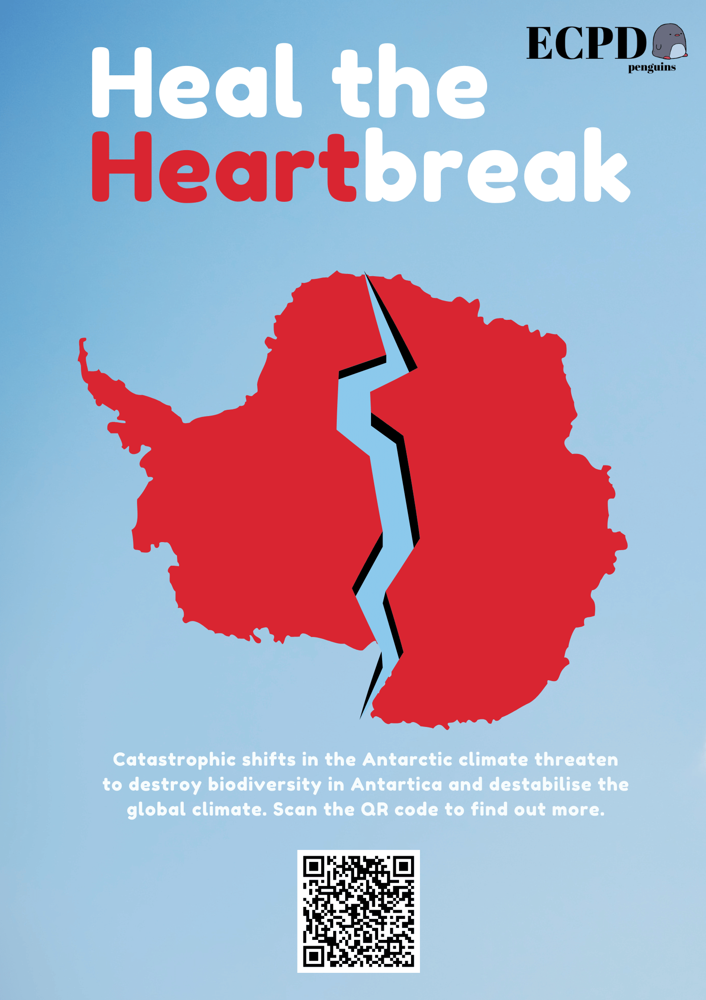
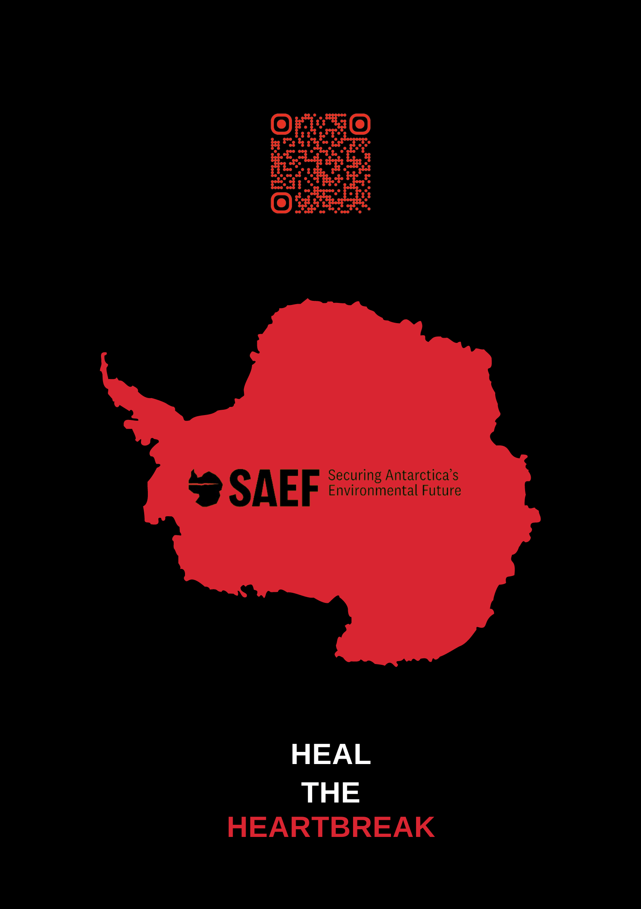
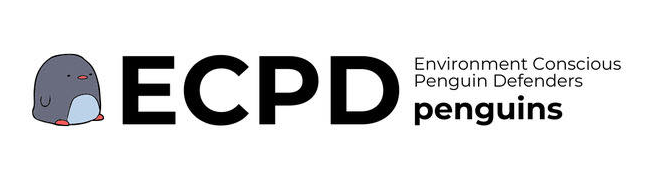

# Research, Experimentation, and Discovery - ECPD Penguins

## 🌏 Raising Awareness About Antarctic Ice Melt & Climate Change

🔗 **Live Website:** [ECPD Penguins - Climate Awareness](https://tngu0394.wixsite.com/saef-project1)

## 📌 Project Overview
In 2024, we developed an interactive website to highlight the pressing issue of melting Antarctic ice and its impact on global climate change. The goal is to **raise awareness** and **encourage environmental protection** through an engaging digital experience accessible worldwide.

## 🛠 Technologies Used
- **Wix** – Website development platform for easy deployment.
- **Canva** – Designed visual content to enhance storytelling.

## 🌱 Impact & Significance
✅ **Educates users** on climate change with interactive visuals.  
✅ **Inspires action** towards environmental sustainability.  
✅ **Accessible globally**, not just within Australia.  

## 📸 Project Gallery
Here are some visuals from our project:

(images/ecpd-art-3.jpg)

## 🚀 Get Involved
If you're interested in climate awareness initiatives or want to collaborate, feel free to connect!

---
📧 **Contact:** [TienNguyenTech](https://github.com/TienNguyenTech)
